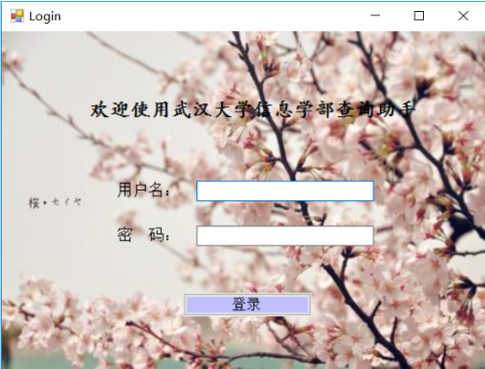
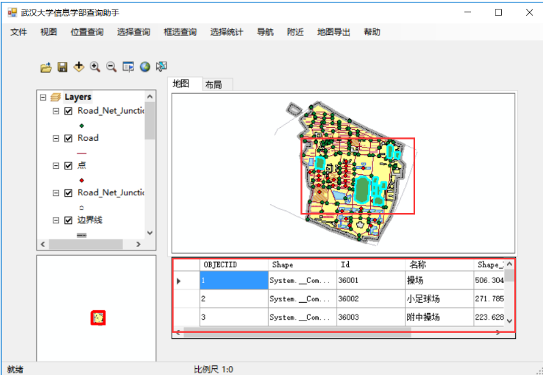

# Campus Info Query
This is a Map Info Query Software developed by Lingwei Luo

Overview
---------
* Framework:  
  * ArcEngine + C# 

* Supported Functions:  
  * file management
    * open map
    * open shp
    * open lyr
    * layer control
  * map management
    * zoom in/out
    * map tour
    * full display
  * map query
    * location query
    * select query
    * box selection query
    * select statistics
    * navigation
    * nerby
  * map export

* Interface
  * Login  

  * Main Page  

